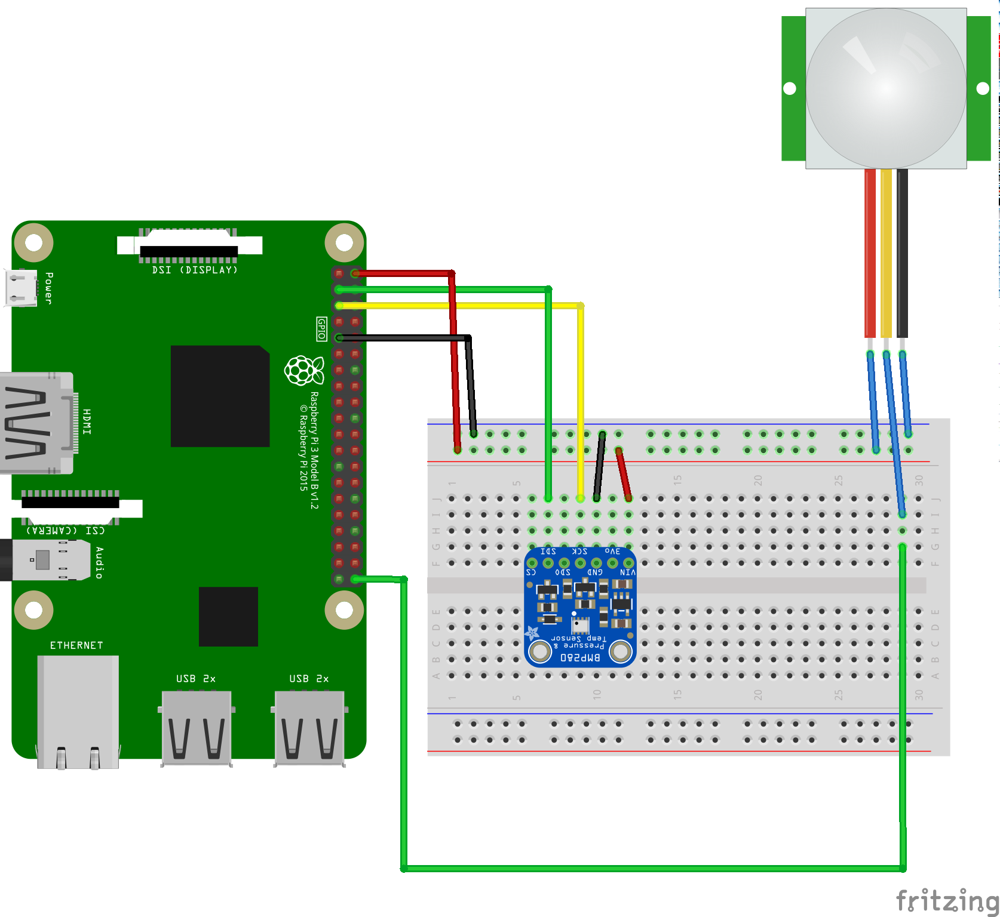

# Cloud IoT Sensor Hub

This sample shows how to implement a sensor hub on Android Things that collects
sensor data from connected sensors and publish on a Google Cloud IoT PubSub topic.

## Introduction

The sample showcases a sensor-based device publishing data to
[Google Cloud IoT Core](https://cloud.google.com/iot-core/). Sensors can be
added or removed dynamically, and the device will reconnect automatically to the
cloud when power or connectivity is lost.

Sensor data collected since the last publish is sent through Cloud IoT every
20 seconds. The amount of data sent depends on the mode of each sensor:

- **Continuous:** Continuous mode sensors (temperature and pressure) publish
  only the most recent value.
- **On-Change:** On-Change mode sensors (motion detection) store up to 10 change
  events in between publications.

## Pre-requisites

- Android Things compatible board
- Android Studio 2.2+
- 1 [bmp280 temperature and pressure](https://www.adafruit.com/product/2651)
- 1 [PIR motion detector sensor](https://www.adafruit.com/product/189)
- [Google Cloud Platform](https://cloud.google.com/) project with Cloud IoT support

## Schematics



## Build and install

On Android Studio, click on the "Run" button.
If you prefer to run on the command line, type
```
./gradlew installDebug
adb shell am start com.example.androidthings.sensorhub/.SensorHubActivity
```

## Prepare the device

This sample will create a key pair (private and public) on the device on the
first run. The private key will be saved to the Android Keystore, using a
secure hardware if one is available. The public key will be printed to logcat
and will be available as a file on your external storage location.

You will need the public key to register your device to Google Cloud IoT. Here's
how you can fetch it:

```
adb pull /sdcard/cloud_iot_auth_certificate.pem
```

or, depending on your platform:

```
adb -d shell "run-as com.example.androidthings.sensorhub cat /data/user/0/com.example.androidthings.sensorhub/files/cloud_iot_auth_certificate.pem" > cloud_iot_auth_certificate.pem
```

A new keypair is only generated again when the device is reflashed.

## Register the device

With the `cloud_iot_auth_certificate.pem` file, you can register your device on
Google Cloud IoT:

```
gcloud iot devices create <DEVICE_ID> --project=<PROJECT_ID> --region=<CLOUD_REGION> --registry=<REGISTRY_ID> --public-key path=cloud_iot_auth_certificate.pem,type=rs256
```

Where:
- `DEVICE_ID`: your device ID (it can be anything that identifies the device for you)
- `PROJECT_ID`: your Cloud IoT project id
- `CLOUD_REGION`: the cloud region for project registry
- `REGISTRY_ID`: the registry name where this device should be registered

## Configure the device

Now that your device's public key is regsitered to Google Cloud IoT, you can set
the device so that it can publish the sensor data to the Cloud IoT MQTT:

```
adb shell am startservice -a com.example.androidthings.sensorhub.mqtt.CONFIGURE -e project_id <PROJECT_ID> -e cloud_region <CLOUD_REGION> -e registry_id <REGISTRY_ID> -e device_id <DEVICE_ID> com.example.androidthings.sensorhub/.cloud.CloudPublisherService
```

## Next steps

If the registration and configuration steps were executed successfully, your
device will immediately start to publish sensor data to Google Cloud IoT.

Take a look at the [Google Cloud IoT documentation](https://cloud.google.com/iot/docs/) to learn how to pipe the
data published by your devices into the other Google Cloud services.

## License

Copyright 2016 The Android Open Source Project, Inc.

Licensed to the Apache Software Foundation (ASF) under one or more contributor
license agreements.  See the NOTICE file distributed with this work for
additional information regarding copyright ownership.  The ASF licenses this
file to you under the Apache License, Version 2.0 (the "License"); you may not
use this file except in compliance with the License.  You may obtain a copy of
the License at

  http://www.apache.org/licenses/LICENSE-2.0

Unless required by applicable law or agreed to in writing, software
distributed under the License is distributed on an "AS IS" BASIS, WITHOUT
WARRANTIES OR CONDITIONS OF ANY KIND, either express or implied.  See the
License for the specific language governing permissions and limitations under
the License.
